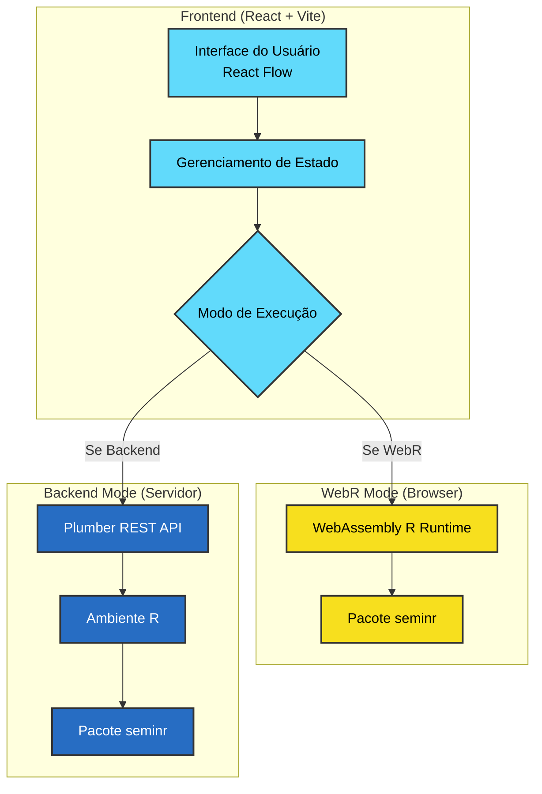

# 🔬 PLS-SEM Web

Uma aplicação web moderna para construir, estimar e avaliar modelos de Equações Estruturais por Mínimos Quadrados Parciais (PLS-SEM) visualmente.

## 🎯 Visão Geral

Esta aplicação permite:
1. **Construir modelos PLS-SEM visualmente** usando um editor de grafos interativo.
2. **Executar análises** usando o pacote `seminr` do R.
3. **Gerar bootstrap** com intervalos de confiança e estatísticas t.
4. **Executar PLSpredict** para avaliar o poder preditivo fora da amostra.
5. **Visualizar resultados** diretamente no diagrama e em tabelas detalhadas.

A aplicação possui **dois modos de execução**:
- **Backend Mode**: Usa uma API REST em R (Plumber) rodando localmente ou em um servidor.
- **WebR Mode**: Roda o R inteiramente dentro do navegador usando WebAssembly (WASM), sem necessidade de servidor backend!

## 🏗️ Arquitetura

Abaixo está o diagrama da arquitetura do projeto, mostrando os dois modos de operação:



## 🚀 Como Executar Localmente

### Pré-requisitos
- **Node.js** 18+ e npm
- **R** 4.0+ (Apenas se for usar o Backend Mode)

### 1. Iniciar o Frontend (Obrigatório)
```bash
cd frontend
npm install
npm run dev
```
Acesse `http://localhost:5173`. O modo WebR já funcionará imediatamente!

### 2. Iniciar o Backend (Opcional - Apenas para Backend Mode)
No R ou RStudio, instale as dependências:
```r
install.packages(c("plumber", "jsonlite", "devtools"))
devtools::install_github("sem-in-r/seminr") # Versão de desenvolvimento necessária
```
Inicie a API:
```bash
cd backend
Rscript start_api.R
```
A API rodará em `http://localhost:8000`.

## 🌐 Como Fazer o Deploy

A grande vantagem da arquitetura com **WebR** é que você pode fazer o deploy da aplicação inteira como um site estático, sem precisar pagar por hospedagem de servidores R!

### Deploy no Netlify (Recomendado)

O projeto já possui um arquivo `netlify.toml` configurado com os headers necessários para o WebR (Cross-Origin Isolation).

**Opção 1: Via Interface Web do Netlify**
1. Faça push do seu código para o GitHub/GitLab/Bitbucket.
2. Crie uma conta no [Netlify](https://www.netlify.com/).
3. Clique em "Add new site" > "Import an existing project".
4. Conecte seu repositório.
5. Configurações de build (devem ser preenchidas automaticamente):
   - **Base directory**: `frontend`
   - **Build command**: `npm run build`
   - **Publish directory**: `frontend/dist`
6. Clique em "Deploy site".

**Opção 2: Via Netlify CLI**
```bash
npm install -g netlify-cli
cd frontend
npm run build
netlify deploy --prod --dir=dist
```

### Deploy na Vercel
1. Conecte seu repositório na Vercel.
2. Configure o Framework Preset como `Vite`.
3. Root Directory: `frontend`.
4. Adicione um arquivo `vercel.json` na pasta `frontend` com os headers CORS necessários para o WebR (SharedArrayBuffer).
5. Faça o deploy.

> **Nota sobre o Backend Mode em Produção:** Se você quiser usar o Backend Mode em produção, precisará hospedar a API R (Plumber) em um servidor VPS (como DigitalOcean, AWS EC2) usando Docker ou PM2, o que gera custos mensais. Recomendamos usar o **WebR Mode** para produção, pois é 100% gratuito e roda no navegador do usuário.

## 🛠️ Tecnologias Utilizadas
- **Frontend**: React 18, Vite, React Flow (Grafos)
- **R no Browser**: WebR (WebAssembly)
- **Backend API**: R, Plumber
- **Estatística**: Pacote `seminr` (PLS-SEM)

## 📄 Licença
Este projeto é open source e está disponível sob a licença MIT.
